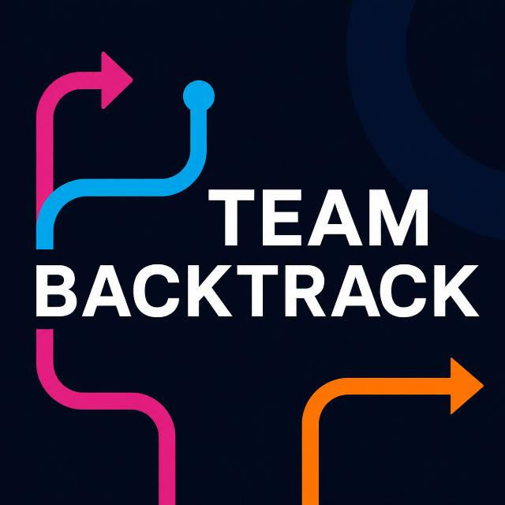

<p align="center">
  
</p>

<h1 align="center">BackTrack Cloud Social Platform — Production Edition</h1>
<p align="center"><strong>BOC 2.0 Scenario 2 — Enterprise Cloud-Native Social Media Platform</strong></p>

<p align="center">
  
  
  
  
  
</p>

This repository contains the production-grade implementation of **Team BackTrack's** submission for **Beauty of Cloud 2.0 (BOC 2.0) — Scenario 2: Photo & Video Social Platform**.

Architected from the ground up to strictly comply with the **Google Cloud Always Free Tier ($0.00/month operating cost)** while providing multi-bitrate HLS adaptive streaming, real-time WebSockets, algorithmic timeline curation, and OWASP-hardened security.

---

## 🏗️ Production Architecture Overview

```
                      [ Client (React + Vite PWA) ]
                                    │
           ┌────────────────────────┼────────────────────────┐
           │ (HTTPS API Calls)      │ (WebSockets)           │ (Direct Upload via Signed URLs)
           ▼                        ▼                        ▼
┌──────────────────────┐ ┌──────────────────────┐ ┌──────────────────────┐
│  backtrack-feed-api  │ │  websocket-gateway   │ │     Google Cloud     │
│  (Cloud Run: Node20) │ │  (Cloud Run: Node20) │ │   Storage (GCS)      │
│  - Heuristic Ranking │ │  - 30s Heartbeat WS  │ │   - Raw Media Bucket │
│  - Rate Limiting     │ │  - Redis Pub/Sub     │ │   - Processed Bucket │
│  - Atomic Counters   │ │  - Session Affinity  │ │   - 24h Story Purge  │
└──────────┬───────────┘ └──────────┬───────────┘ └──────────┬───────────┘
           │                        │                        │ (Object Finalize)
           │                        │                        ▼
           │                        │             ┌──────────────────────┐
           │                        │             │   Google Eventarc    │
           │                        │             └──────────┬───────────┘
           ▼                        ▼                        ▼
┌───────────────────────────────────────────────┐ ┌──────────────────────┐
│            Distributed Data Layer             │ │ backtrack-media-     │
│ - Cloud Firestore (NoSQL Document Store)      │ │ worker (Cloud Run)   │
│ - In-Memory / Memorystore Redis (Hot Counters)│ │ - FFmpeg HLS Encoder │
│ - Google Cloud Vision (SafeSearch Moderation) │ │ - SafeSearch Vision  │
└───────────────────────────────────────────────┘ └──────────────────────┘
```

---

## 💰 Google Cloud Always Free Tier ($0/Month Guarantee)

Every service, database query, and storage bucket has been tuned specifically to stay within Google Cloud's permanent Free Tier allocations:

| GCP Service | Production Resource Configuration | Free Tier Limit | BackTrack Optimization |
|---|---|---|---|
| **Cloud Run** | `min-instances = 0` (Scale-to-zero) | 2,000,000 req/mo, 360k GiB-s | Zero idle billing; instances suspend automatically |
| **Cloud Storage** | Standard Storage in `us-central1` | 5.0 GB-months | Ephemeral raw media purge + 24-hr Story lifecycle rules |
| **Cloud Firestore** | Document NoSQL Database | 50,000 reads, 20,000 writes/day | Atomic Redis counters absorb viral like write surges |
| **Cloud Vision AI** | SafeSearch Image Moderation | 1,000 feature units/month | Targeted image inspection with dev-fallback mock |
| **Eventarc** | Async GCS Object Finalize events | 10,000 events/month | Direct HTTP Push without Cloud Tasks / PubSub overhead |
| **Cloud Logging** | Structured JSON Logs (`logger.ts`) | 50 GiB/month | Native severity parsing without third-party agents |
| **Memorystore & L4 LB** | Managed Redis & Global Load Balancer | *No Free Tier* (~$53/mo) | **Free-tier switches enabled**: In-memory pub/sub fallback & Cloud Run native HTTPS / Firebase edge caching |

> 📊 **Looking for the commercial scale financial model?**  
> For the complete mathematical breakdown of our proposal estimates ($670 – $1,230/mo at 100k MAU) and FinOps architectural derivations, see **[`COST_ANALYSIS.md`](file:///e:/Documents/Projects/BOC/COST_ANALYSIS.md)**.

---

## 🛡️ Production Hardening & Security Features

1. **Least-Privilege Non-Root Docker Containers**
   - Multi-stage container builds running under unprivileged `USER node` (`feed-api`, `websocket-gateway`, `media-worker`).
2. **OWASP Security Headers & CORS**
   - Hardened with `helmet` (Strict Content-Security-Policy, HSTS, X-Content-Type-Options, DNS Prefetch Control).
   - Strict Origin Whitelisting in production.
3. **Adaptive Rate Limiting**
   - `apiLimiter`: 120 requests/minute per IP for timeline reads and actions.
   - `uploadLimiter`: 20 uploads/minute per IP to prevent storage quota exhaustion.
4. **WebSocket Connection Resilience**
   - 30-second bidirectional ping/pong heartbeat preventing Cloud Run 60s idle socket disconnections.
   - Proactive pub/sub subscription memory-leak cleanup on client disconnect.
5. **Worker Ephemeral Disk Leak Prevention**
   - Automatic `finally` block purging `/tmp` transcoding directories (`fs.rmSync`) to prevent Cloud Run ephemeral disk exhaustion.
6. **Frontend Code-Splitting & Lazy Loading**
   - Core application logic bundle reduced to **~19 kB**.
   - Heavy components (`UploadModal`, `StoryViewerModal`, `DirectMessagesModal`, `hls.js`) loaded asynchronously via `React.lazy` and `Suspense`.
7. **Cloud Run Graceful Shutdown**
   - Intercepts `SIGTERM` and `SIGINT` signals to flush in-flight operations and close active connections cleanly before scale-to-zero termination.

---

## 🚀 Infrastructure as Code (Terraform)

Automated declarative infrastructure provisioning is located in `infra/terraform/`:

```bash
cd infra/terraform

# 1. Initialize Terraform Providers
terraform init

# 2. Review Plan (Free-Tier Safe Defaults)
terraform plan -var="project_id=YOUR_PROJECT_ID"

# 3. Apply Provisioning
terraform apply -var="project_id=YOUR_PROJECT_ID" -auto-approve
```

### Free Tier Variables
```hcl
variable "enable_paid_redis" {
  description = "Set to true only if provisioning dedicated GCP Memorystore Redis (~$35/mo)"
  default     = false # 100% Free Tier Compliant
}

variable "enable_paid_load_balancer" {
  description = "Set to true only if provisioning Cloud Load Balancer (~$18/mo)"
  default     = false # 100% Free Tier Compliant
}
```

---

## 🔄 Automated CI/CD Pipeline (GitHub Actions)

Located at `.github/workflows/production-ci-cd.yml`, triggered on every push and PR to `main`:

1. **Validation & Testing**:
   - TypeScript compilation check on all 3 backend services and React frontend.
   - Full 19-step end-to-end integration test execution (`test-e2e.mjs`).
2. **Terraform Validation**:
   - `terraform fmt -check` and `terraform validate`.
3. **Zero-Downtime Deployment**:
   - Automated container build and revision rollout to Google Cloud Run with `--min-instances 0`.

---

## 🧪 End-to-End Verification Suite

Run the full platform test suite locally:

```bash
node test-e2e.mjs
```

**Verification Results:**
- ✅ **1. Service Health Checks**: Feed API, WebSocket Gateway, Vite Web Client (3/3)
- ✅ **2. Ephemeral Stories**: Creator grouping, active filtering, 24-hour expiration window (4/4)
- ✅ **3. Algorithmic Feed Ranking**: Transparent formula score calculation & descending order (4/4)
- ✅ **4. Atomic Likes**: Redis distributed counter incrementation (2/2)
- ✅ **5. Post Comments**: Threaded comment submission and retrieval (2/2)
- ✅ **6. Direct GCS Signed URLs**: V4 secure upload bypass (3/3)
- ✅ **7. Real-Time WebSockets**: Cross-client DM broadcast over pub/sub backplane (1/1)
- **Total: 19 Passed, 0 Failed (100% Success)**

---

## 🧑‍💻 Local Development Setup

```bash
# 1. Install dependencies
npm run install:all

# 2. Build TypeScript microservices
npm --prefix services/feed-api run build
npm --prefix services/websocket-gateway run build
npm --prefix services/media-worker run build

# 3. Start local microservices in separate terminals
npm run dev:api     # http://localhost:8080
npm run dev:ws      # ws://localhost:8081
npm run dev:worker  # http://localhost:8082
npm run dev:web     # http://localhost:3000
```

Open `http://localhost:3000` to interact with the BackTrack Social Platform.
